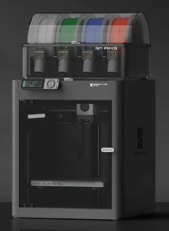

## Adventures in 3D printing 001

I have been watching 3d printers since they first started to come out. Its been a long road, and I have always said to myself around the house "a 3d printer could make ___ here". I hadnt pulled the trigger until recently. After a lot of research I picked up a [BambuLabs P1S 3D printer with AMS](https://ca.store.bambulab.com/products/p1s?variant=44472890786032&currency=CAD&gad_source=1&gclid=Cj0KCQjw99e4BhDiARIsAISE7P_Kv9fA1Acgi9cT2C8p-PVsuhlKCAvhLSqNxhQ9y-7j0P6IxY_i7d0aAtAlEALw_wcB). 

This thing is amazing, BambuLabs has really focused on the hobby of 3d printing, and not the hobby of maintaining a 3d printer. Out of the box I was printing in ~30mins. They claim 15mins, but maybe I'm slow. The AMS allows for multi-color pain-free prints too ! 

The print quality is amazing, If you didnt know you were looking at a 3d print, you probably couldn't tell. The community-based app for models is also fantastic. 

My first prints were around Halloween. So I was able to contribute to my Wife's holiday decor (tastefully). 

BambuLabs provides a fantastic community, [Makerworld](https://makerworld.com/en), to share models, that can print directly to the printer. With this, and reddit I'm officially hooked !