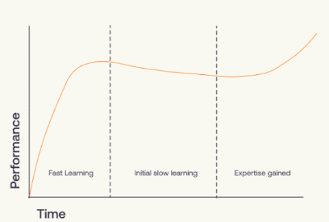
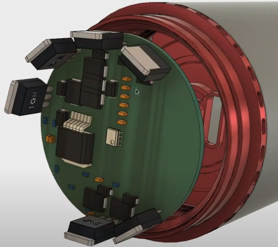
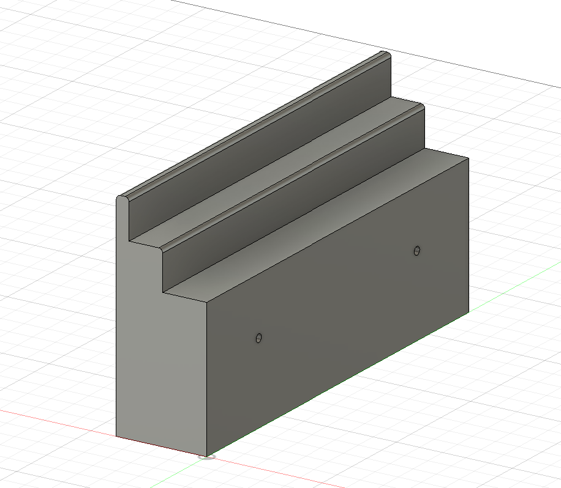
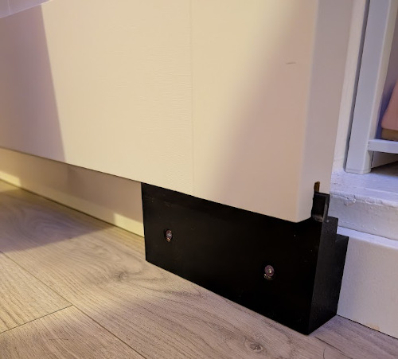

## Adventures in 3D printing 002

I didnt get a printer to only print other people's work, I wanted it to solve niche issues around my house and life. I knew this meant a learning curve. 

After poking around on the internet I decided on Autodesk Fusion 360 for personal use. 

> Autodesk Fusion for personal use is a limited, free version that includes basic functionality for qualifying users who generate less than CA$1355 in annual revenue and use for home-based, non-commercial projects only.

I only intend to have fun and learn. [Autodesk bought EAGLE in 2016](https://www.autodesk.com/products/fusion-360/blog/autodesk-acquires-eagle-qa-look-future/), and as an Electrical Engineer, I may want to dabble in shared mechanical and electrical design.

### Getting Dangerous

For years, I've been eyeing projects around the house that could use a simple bracket, or spacer, or gadget. After printing other people's models online I grew slightly bored. One of my first projects to design was better track for a closet barn door.

House is old, and the closet is non-standard size and shape. The bottom of the closet door hovers above the floor a several inches. This meant that the barn door doesnt reach the floor as it should.

This solution works very well, and looks good. I learned a lot about modelling, and some of the terminology. I'm starting to understand more about 3d printing, and the pitfalls. However... its starting to feel like the possibilities are limitless !

