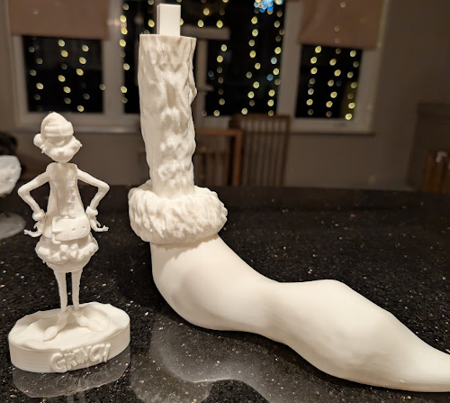

## Adventures in 3D printing 003 (aka GRINCH pt1)

Remember I am no expert, and am ~~probably~~ making lots of mistakes. But they're my mistakes. Until now, I've printed the occasional gadget around the house. Generally, improving the "kits" you get from the big box stores. Sure they work well, but not all houses are exact, and sometimes the hardware doesnt fit. 

I started exploring the internet, and I started to want to print something **GIANT**. I had been searching the internet for an idea since Halloween, but time started to run out for the Halloween holiday. I considered printing a giant mammoth skeleton... but they sell giant human skeletons at the big box stores. So thats not very exciting. 

### GRINCH ! 

The next upcoming holiday is Christmas. I decided I wanted a giant Grinch ! First step was finding a suitable model. It had to be a nice grinch, and one that would scale nicely. After some searching I found one. 

I did a test print 6" tall and it has excellent detail. 

### Modelling

I have never done this before, and I understand the model will need to be scaled up and sliced into pieces. There are a few youtube videos of people demonstrating their process. I tested several programs, and struggled a bit with the interfaces and control. I wished there was a program like Fusion360, because I am not familiar with that...

Turns out, Fusion360 works very well for this. I developed a process of cutting into pieces that fit into my printer.

* scale entire model up to a size that wouldnt require too many parts
* create 224mm cubes
* use the faces of the cubes to cut (separate) the model into printer sized parts
* add "alignment pegs" so that the pieces fit together nicely when glueing later

The last step is probably the most important for a large model. My first pegs were built into the model, and square shaped.

> I learned this is not the best "aligner"

The square pegs fit nearly perfectly, but there are a few drawbacks:

* The tolerance of my 3d printer is very good, O.D. and I.D. pegs fit very well together, but the tolerances also have dependency on filament quality, ambient temperature, moisture, etc. I dont want to risk sanding the pegs of every piece
* the pegs add height to the models, where my slicing was already pushing the limits of my printer
* built-in pegs can limit the orientation pieces are printed. (What if its easier to print upside down ?)
* squares are very permanent if the model has a bit of drift

My solution. *Circular* pegs that are independent of the sliced models. 

* pegs can be printed smaller to allow for tolerance
* easier to sand if necessary
* dont add height to models. Models just require a "pocket"
* models can be oriented on any surface without needing excessive supports
* not permanently attached to the model

### Progress

Where are the pics ? I would have scrolled here first too. 

To Give an idea of my scale... What did I get myself into?

Starting to take shape. I think I got lucky with the square pegs. I'm happy I updated them along the way. The texture of the "fur" is really nice.

Its starting to take shape. The seams are very small, and it holds together pretty well without glue. 

At this point I'm about 50% complete. Wish me luck that I make it in time for Christmas ! 

