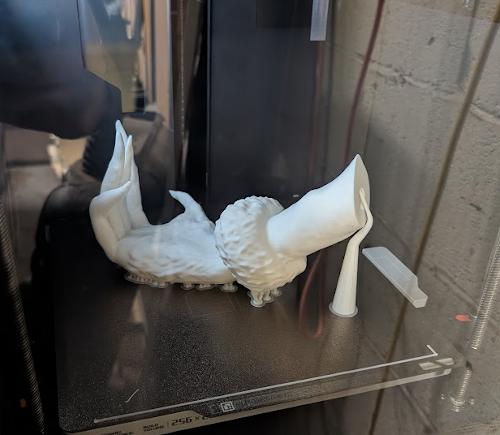
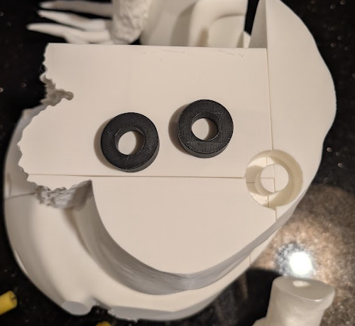
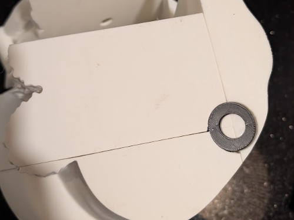
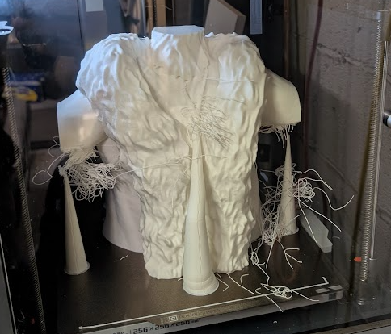
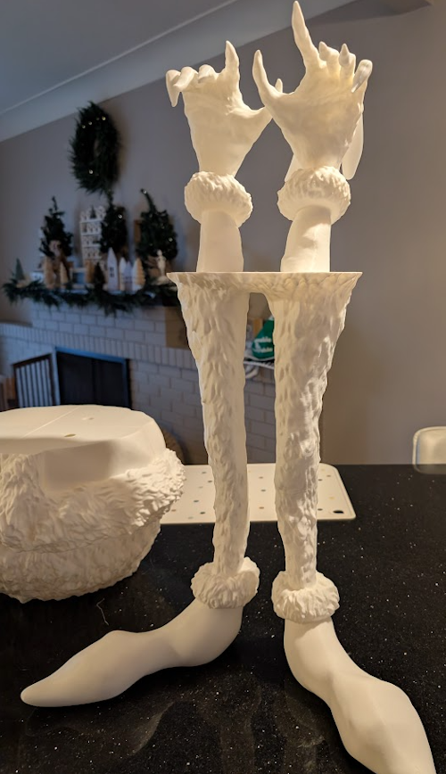
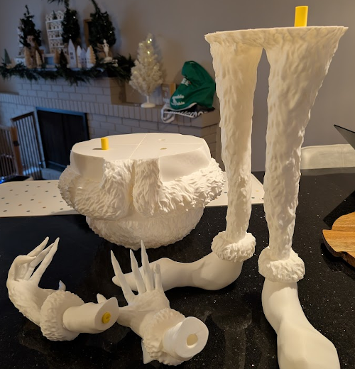
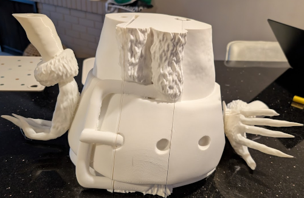

## Adventures in 3D printing 004 (aka GRINCH pt2)

> I'm still not an expert :D

The Grinch is progressing. The middle section has several pieces. I tried my best to align the pieces such that the seams are well hidden. 

Seeing giant parts in the printer several hours later never gets old.

### Damage Tally

So far, I'm down 4x1kg rolls. I way underestimated the volume of filament needed.

Approximate Timing:

* left foot : 5:00
* right foot: 5:00
* legs: 6:20
* belly section: 11:18 + 9:30m + 11:10 + 9:32
* belt section: 7:08 + 11:12 + 10:57 + 4:00 + 4:00 + 9:17
* shoulders/neck : 14:03

Total (without head): 118 hours 27 mins

### Learning Successes

I'm **still** learning as I go. While printing large pieces, and waiting many hours I found a few ways to optimize the print process. 

* shell your print - this makes the inside hollow, less material, and less time. 
* orient the part on the plate to find the optimal print path
* optimize the supports - this can be risky
* increase print speed - reduces the layers, but for the texture and size of my print it negligible. 

I eventually realized that my alignment pegs were not the best solution. In the middle of the model, I had several pieces that would need alignment and evenutally glue, which would have been a nightmare. I discovered that I could design a "catch" on the outside that holds all the pieces together.

> I wish I had thought of this sooner..

This works fantastically. Thinking about it after, not only does it align the parts, but it **pulls** the parts together. Eliminating the need for glue. 

### Learning Failures

I started to get overconfident working the print settings for material and time. 

For the uninformed, the filament spaghetti is when there isnt a surface for the filament to extrude onto. Thus it drops filament into thin air... probably for a few hours... You can generally get away with overhangs that have a gradual incline. The printer's suggested setting for supports is 35 degree overhangs. I attempted 10 degrees... and paid the price. 

Once trimmed, the damage isnt too bad. The "armpits" are missing the lower half. I might be able to save this, however for the sake of timing I am trucking forward.

### Progress

I did lose almost a week from shipping delays (Canada Post Strike). Foresight I guess...

If only the grinch was just legs and hands

a few parts are fully assembled.

Waiting for more pieces before proceeding with more assembly

