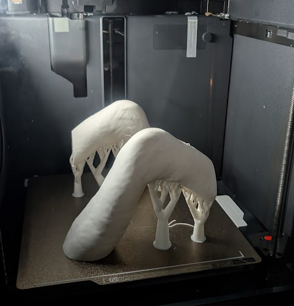
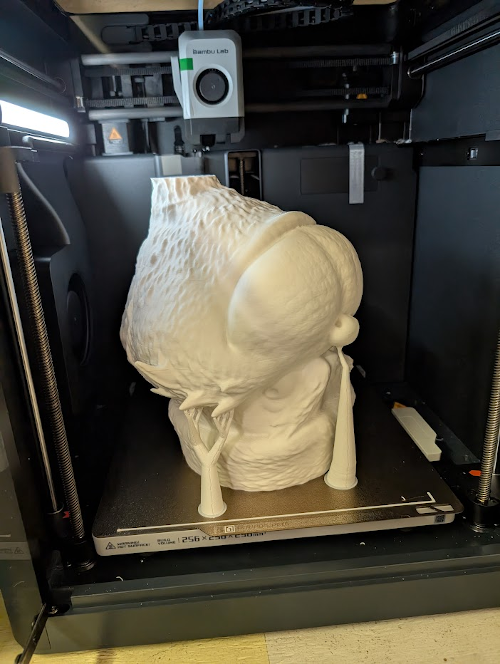
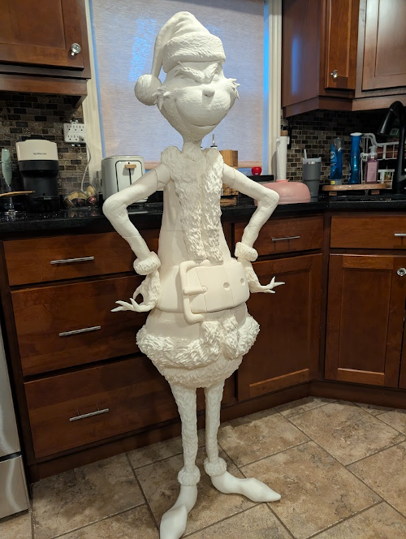

## Adventures in 3D printing 005 (aka GRINCH pt3)

It never ceases to surprise me how long some of these take.

### Damage Tally

So far, I'm down 6.5x1kg rolls

Approximate Timing:

* left foot : 5:00
* right foot: 5:00
* legs: 6:20
* belly section: 11:18 + 9:30m + 11:10 + 9:32
* belt section: 7:08 + 11:12 + 10:57 + 4:00 + 4:00 + 9:17
* shoulders/neck : 14:03 
* left & right elbow: 8:30
* hat - 4:27
* head - 19:38
* armpits - 0:33

Total (without head): 151hours 35mins

### Modelling Lessons

While cutting pieces, I ran into an issue in Fusion360 where it constantly crashed on me when trying to insert the alignment pockets. Obviously very frustrating. I eventually worked around the issue by reducing the number of triangles, saving often, and walking away from my computer while it was eating up all my RAM. 

Another hiccup I started to face in the project was the Fusion360 would *falsely* ? assume my mesh wasn't close, despite fusion having done the mesh repair, and indicating the mesh was in fact closed. The workaroound for this ended up:

* reduce the number of triangles
* convert mesh -> solid object
* add the pocket using objects
* convert solid object -> mesh
* shell the mesh
   * yes, I know solids can be shelled as well, but the number of surfaces crashed the application. Mesh shelling, just seems more efficient.
* export for printing

> If there's a better fix let me know

### Progress

I have finally finished printing all the pieces. The head was very satisfying to see develop.

Assembly ! Using my alignment pins, and a bit of glue. The entire thing came together nicely. Standing 4'7". 

Time for (filler if I have time), but most importantly paint ! 
